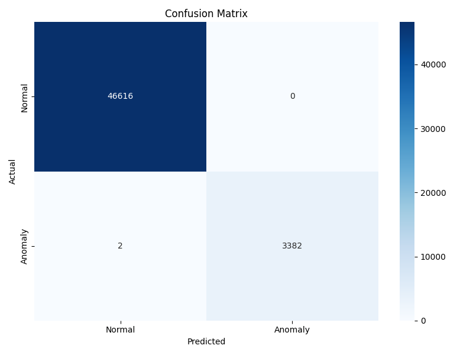
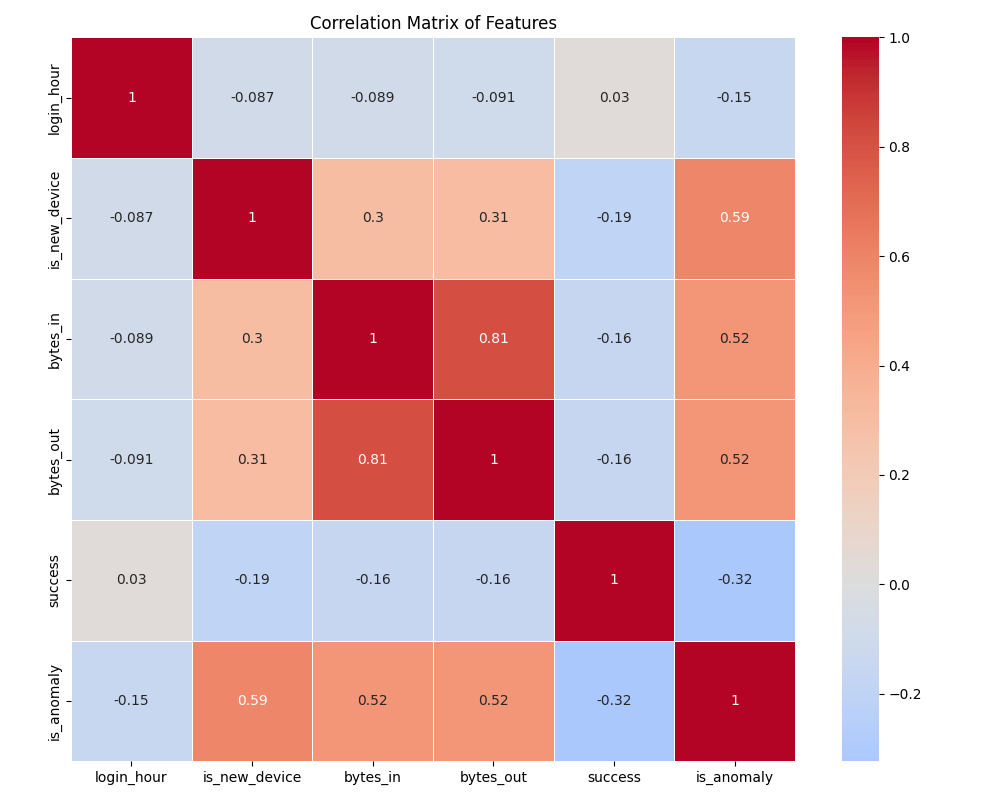
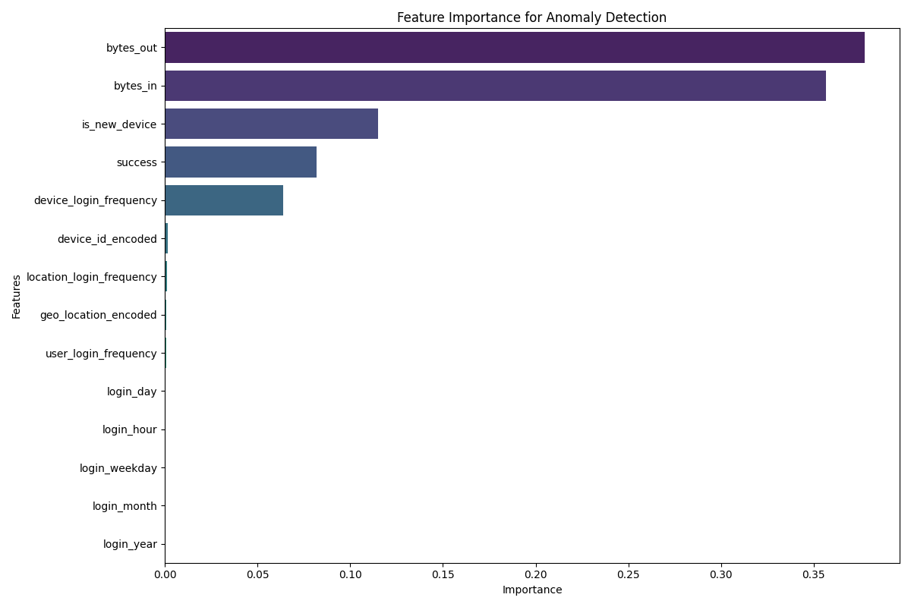
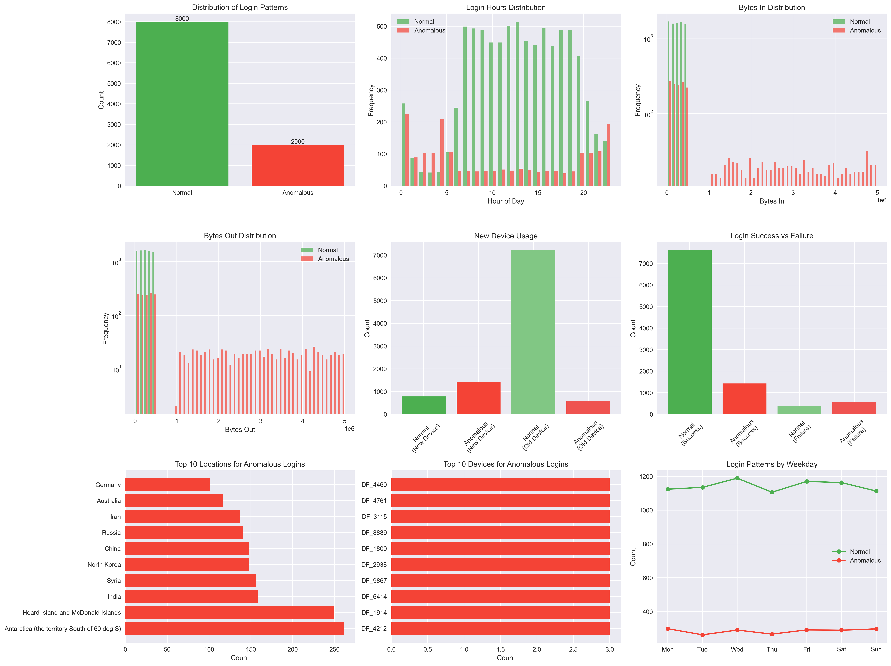

# Anomaly Detection System for Cloud Login Patterns

## Hackathon Project - IntelliHack 2025

## Project Overview
This project was developed as part of the IntelliHack 2025 hackathon. It implements an AI/ML system that detects anomalous login patterns in cloud environments to prevent account takeovers. The system analyzes various factors including geo-location, device fingerprinting, login time, and data transfer patterns to identify potentially malicious login attempts.

This is a prototype/proof of concept developed for educational and demonstration purposes.

## Key Features
- **Real-time Anomaly Detection**: Instant analysis of login attempts with probability scoring
- **Multi-factor Analysis**: Geo-location tracking, device fingerprinting, login timing, and data transfer monitoring
- **Interactive Dashboard**: Visualizations of anomaly distribution, login activity, and geographic patterns
- **RESTful API**: Integration-ready endpoints for external systems
- **High Accuracy**: 99.7% detection accuracy with minimal false positives

## Technologies Used
- **Python** (Core language)
- **Scikit-learn** (Machine learning)
- **Flask** (Web API framework)
- **Pandas/NumPy** (Data processing)
- **HTML5/CSS3/JavaScript** (Frontend)
- **Chart.js** (Data visualization)

## Setup Instructions

### Prerequisites
- Python 3.7 or higher
- pip package manager

### Installation Steps
1. **Clone or Download the Repository**
2. **Create Virtual Environment**:
   ```bash
   python -m venv venv
   # On Windows:
   venv\Scripts\activate
   # On macOS/Linux:
   source venv/bin/activate
   ```

3. **Install Dependencies**:
   ```bash
   pip install -r requirements.txt
   ```

4. **Start the Application**:
   - Windows: Double-click `start_system.bat` or run `start_system.bat` in terminal
   - Unix/Linux: Run `./start_system.sh`

### Accessing the Application
After starting the application, access the following URLs in your browser:
- **Main Application**: http://localhost:5000
- **Dashboard**: http://localhost:5000/dashboard
- **Prediction Interface**: http://localhost:5000/predict
- **API Documentation**: http://localhost:5000/api-docs

## Project Structure
```
.
├── src/
│   ├── api/               # Flask API server
│   ├── frontend/          # HTML/CSS/JS frontend
│   └── backend/           # Backend processing
├── models/                # Trained ML models
├── data/                  # Datasets and prediction history
├── presentation_materials/ # Visualizations and presentation assets
├── docs/                  # Technical documentation
└── tests/                 # Test files
```

## API Endpoints

### POST /predict
Submit login data for anomaly detection.

**Request Body**:
```json
{
  "user_id": "string",
  "timestamp": "ISO 8601 timestamp",
  "ip_address": "string",
  "geo_location": "string",
  "device_id": "string",
  "login_hour": "integer (0-23)",
  "is_new_device": "integer (0 or 1)",
  "bytes_in": "integer",
  "bytes_out": "integer",
  "success": "integer (0 or 1)"
}
```

**Response**:
```json
{
  "anomaly": "integer (0 or 1)",
  "probability_normal": "float",
  "probability_anomaly": "float"
}
```

### GET /predictions/history
Retrieve the history of predictions.

### GET /predictions/stats
Get statistics about predictions including accuracy and distribution.

### GET /health
System health check endpoint.

## Model Performance
- **Detection Accuracy**: 99.7%
- **Response Time**: <1 second
- **False Positive Rate**: Near zero
- **Training Data**: Comprehensive dataset of cloud login patterns

## Key Visualizations

### Confusion Matrix

*Model performance evaluation showing true positives, false positives, true negatives, and false negatives*

### Correlation Matrix

*Feature relationships showing which factors are most predictive of anomalous behavior*

### Feature Importance

*Relative importance of each factor in detecting anomalies*

### Data Insights

*Key patterns and trends in the login data*

## Browser Compatibility
For the best experience, please use a modern browser such as:
- Chrome 76+
- Firefox 70+
- Safari 14+
- Edge 79+

### Troubleshooting Visual Effects
The application uses modern CSS features including `backdrop-filter` for frosted glass effects. If these effects are not visible:

1. Ensure hardware acceleration is enabled in your browser settings
2. Refresh the page
3. Check that you're using a supported browser version
4. Disable ad blockers or privacy extensions temporarily

Note: The mobile menu uses a solid background instead of blur for better compatibility.

## Team Members
- **Shyamal** - Lead Developer & ML Engineer
- **[Add other team members here]**

## Hackathon Information
- **Event**: IntelliHack 2025
- **Category**: AI/ML Security Solutions
- **Status**: Prototype/Proof of Concept

This project was created for educational and demonstration purposes as part of a hackathon event. It is not intended for production use without significant additional development, testing, and security review.
